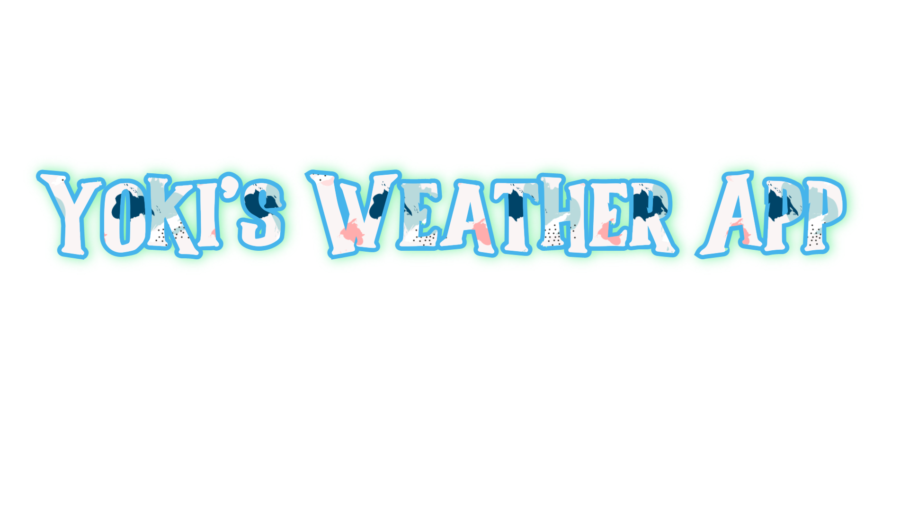
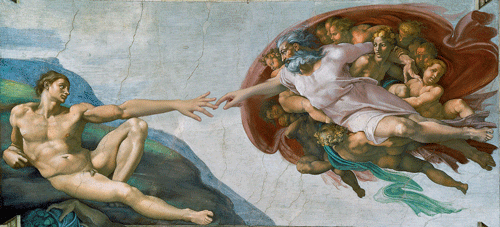

  <h1>
    
    Hi there, myself Akshay Ashok a.k.a YoKi.
    
  </h1>

  
  

 
- 🔭 I’m currently working to become a full stack developer.
- 🌱 I’m currently learning <a href="https://javascript.info/">JavaScript</a>.
- 👯 I’m looking to collaborate on test.
- 📫 How to reach me: [Email-ID: akshayashokdj@gmail.com]
-  ⚡ Fun fact: JavaScript took just 10 days to develop.

<h2 align="center">
The materials I used for studies 👨‍💻
</h2> 

  <strong>✨ HTML and CSS</strong>
        <ul> 
          <li><a href="https://www.youtube.com/c/TheNetNinja">The Net Ninja</a></li>
        </ul>
  <strong>✨ JavaScript</strong>
       &nbsp;&nbsp;&nbsp;&nbsp;
       <ul>
         <li><a href="https://www.youtube.com/watch?v=jS4aFq5-91M&t=26701s ">FreeCodeCamp</a></li>
         <li><a href="https://www.youtube.com/watch?v=3PHXvlpOkf4&ab_channel=freeCodeCamp.org">15 project's</a> in FreeCodeCamp</li>
         <li><a href="https://developer.mozilla.org/en-US/docs/Web/JavaScript">mdn web doc</a></li>
         <li><a href="https://javascript.info/">Javascript.info</a></li>
       </ul>

<h2 align="center">Some Yokified Stuff 👾</h2> 
  

    
    
  

  

 <h2 align="center"> Tools & Technology 🛠</h2>

  

 
    
    
 <h2 align="center"> GitHub Statistics 📈 </h2>

    
     

 
<h2 align="center">Trophies 🏆</h2>

  

 
<h2 align="center"></h2>

 

 
 <h2 align="center">"May the Force be with you"</h2>

  

Note : 
"May the Force be with you" is charming but it's not important. 
 What's important is that you become the Force - for yourself 
 and perhaps for other people.

  

<!--
**yoki1234/yoki1234** is a ✨ _special_ ✨ repository because its `README.md` (this file) appears on your GitHub profile.

Here are some ideas to get you started:

- 🔭 I’m currently working on ...
- 🌱 I’m currently learning ...
- 👯 I’m looking to collaborate on ...
- 🤔 I’m looking for help with ...
- 💬 Ask me about ...
- 📫 How to reach me: ...
- 😄 Pronouns: ...
- ⚡ Fun fact: ...
-->
